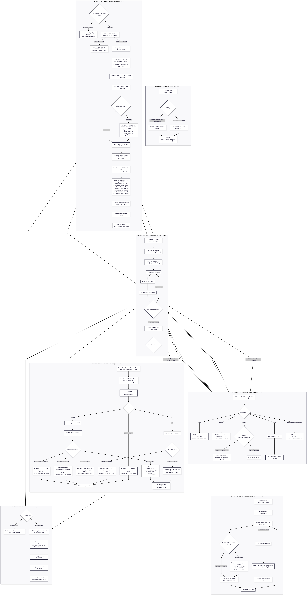

# ⚔️ Chronicle — Ironhold World Engine

<p align="center">
  
  
  
  
  
</p>

---

> 🎮 **Chronicle** is a high-performance C++20 game world engine built for **Ironhold** — an open-world survival game. It tracks thousands of player entities, NPCs, and world state across server restarts using **hardware-aligned $4\text{ KB}$ binary disk pages**, ensuring microsecond-level query responses and zero heap fragmentation.

---

## ⚡ Engine Specifications & Architecture Matrix

| Metric / Component | Specification | Technical Highlights |
| :--- | :--- | :--- |
| **Language Standard** | `C++20 STL` | Zero-allocation binary stream I/O and strict type safety |
| **Disk Page Size** | `4096 Bytes (4 KB)` | Aligned to hardware disk sectors for maximum I/O throughput |
| **Record Size** | `291 Bytes` payload | Zero-copy Little-Endian `uint32_t` ID + fixed null-padded strings |
| **Page Density** | `14 Entities / Page` | $99.4\%$ space efficiency per 4KB page ($22\text{B}$ tail padding) |
| **World Capacity** | `100 Pages (1400 Entities)` | Bounded memory footprint avoiding RAM bloat |
| **Caching Strategy** | `Lazy Loading & Writeback` | Pages load into RAM on demand; flushed cleanly on `.quit` |

---

## 🗺️ Project Architecture & Data Flow

<p align="center">
  
</p>

---

## 📦 Binary Entity Memory Layout (`PlayerRecord` — 291 Bytes)

```text
+-------------------+-----------------------------------+---------------------------------------------------+
|  id (uint32_t)    |         username (char[32])       |               email (char[255])                   |
|   Bytes 0 .. 3    |           Bytes 4 .. 35           |                 Bytes 36 .. 290                   |
+-------------------+-----------------------------------+---------------------------------------------------+
|<---- 4 Bytes ---->|<------------ 32 Bytes ----------->|<------------------- 255 Bytes ------------------->|
|<--------------------------------------- Total: 291 Bytes ------------------------------------------------>|
```

---

## 🚀 Milestone Achievements & Evolution

### 🕹️ Milestone 1 — The Game Debug Console
- **Interactive REPL**: Live command prompt (`ironhold> `) accepting admin commands.
- **System Dot-Commands**: `.help`, `.version`, `.status`, `.quit`.
- **Input Buffer**: Clean whitespace trimming & silent session logging (`ironhold_clean.log`).

### 👥 Milestone 2 — Entity Commands & In-Memory World State
- **Entity Model**: Fixed `Player` entity with ID validation ($\le 0$ rejected), username ($\le 32$ chars), and email ($\le 255$ chars).
- **Command Parser & Executor**:
  - `SPAWN PLAYER <id> <username> <email>`: Validates fields & rejects duplicate IDs.
  - `LIST PLAYERS`: Lists active entities sorted by ID ascending, followed by entity count.

### 💾 Milestone 3 — The Persistent Binary World
- **Paged Storage Engine**: Transformed ephemeral storage into disk-backed binary `.world` files.
- **Lazy Page Cache**: Loads $4\text{ KB}$ pages into RAM only when an entity slot within that page is accessed.
- **Clean Shutdown Flush**: Flushes modified dirty pages to disk on `.quit` and restores world state on engine restart.
- **Dynamic `.status`**: Reports online world file, saved entity count, and total page allocation:
  ```text
  World: online — ironhold.world (42 entities, 3 pages)
  ```

---

## 📂 Repository Structure

```
chronicle/
├── include/
│   ├── application_state.hpp   # System/App state definitions (AppState enum)
│   ├── command.hpp             # Command parser & executor signatures
│   ├── console.hpp             # REPL debug console interface
│   ├── entity.hpp              # Player entity struct & Pager-backed WorldState
│   ├── input_buffer.hpp        # Whitespace trimming & history logger
│   └── pager.hpp               # Binary Page (4KB) & Pager persistence manager
├── src/
│   ├── command.cpp             # Command parser & executor implementation
│   ├── console.cpp             # Interactive shell loop & dot-command handlers
│   ├── input_buffer.cpp        # InputBuffer helper implementations
│   ├── main.cpp                # Engine CLI entry point
│   └── pager.cpp               # Binary page caching, lazy loading, & disk flush
├── tests/                      # Automated milestone test suites
│   ├── testsm1/                # Milestone 1 tests (5/5 PASS)
│   ├── testsm2/                # Milestone 2 tests (5/5 PASS)
│   └── testsm3/                # Milestone 3 tests (5/5 PASS)
├── assets/
│   └── flow.png                # Architecture flow diagram
├── Makefile                    # Build configuration (C++20)
└── README.md                   # Engine documentation & benchmark metrics
```

---

## 🛠️ Build & Usage Instructions

### 1. Build the Binary
Requires a C++20 compliant compiler (`g++` or `clang++`).
```bash
make clean && make
```

### 2. Launch Engine with World Persistence
Pass the `.world` storage file as a CLI argument:
```bash
./chronicle ironhold.world
```

### 3. Example Interactive Multi-Session Workflow

**Session 1 — Spawning Entities & Saving World State:**
```text
$ ./chronicle ironhold.world
ironhold> SPAWN PLAYER 1 alice alice@ironhold.gg
Spawned.
ironhold> SPAWN PLAYER 2 bob bob@ironhold.gg
Spawned.
ironhold> .status
World: online — ironhold.world (2 entities, 1 pages)
ironhold> .quit
$
```

**Session 2 — Process Restart & State Restoration:**
```text
$ ./chronicle ironhold.world
ironhold> LIST PLAYERS
[1] alice <alice@ironhold.gg>
[2] bob <bob@ironhold.gg>
2 entities.
ironhold> .status
World: online — ironhold.world (2 entities, 1 pages)
ironhold> .quit
$
```

---

## 🧪 Automated Test Suite Execution

Run the complete 15-test automated milestone verification suite:

```bash
for suite in tests/testsm1 tests/testsm2 tests/testsm3; do
    echo "=== $suite ==="
    for t in "$suite"/*.sh; do
        bash "$t" ./chronicle
    done
done
```
```text
Total Test Suites: 15 | Passed: 15 | Failed: 0 | Status: 100% Operational
```
