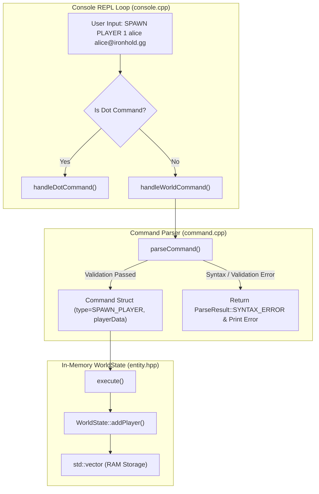
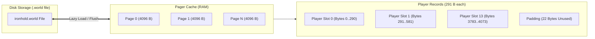
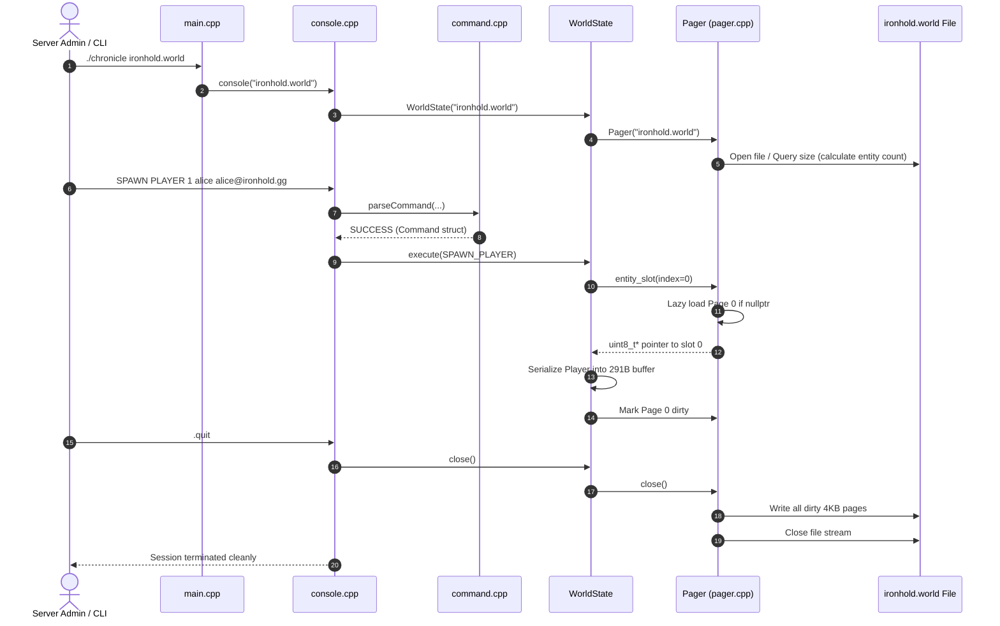
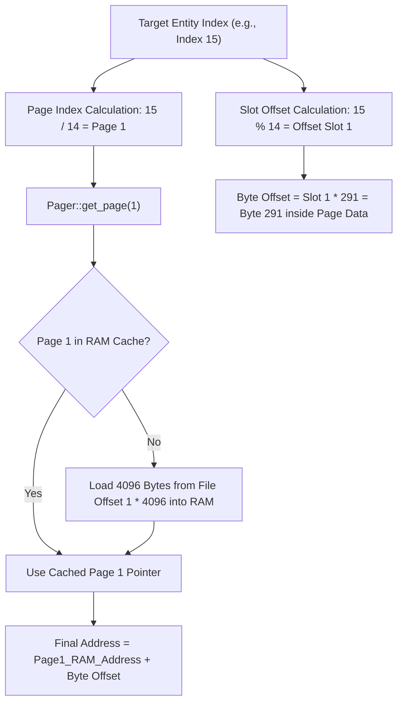
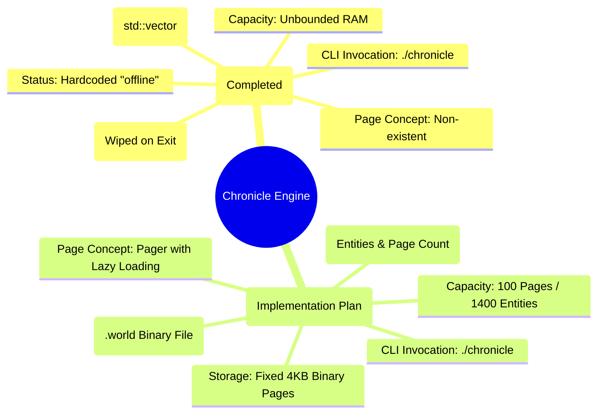

# 📜 Chronicle - Milestone 3 Technical Architecture & Implementation Plan

> **Project:** Ironhold Game Engine Backend — *Chronicle World Engine*  
> **Target Milestone:** Milestone 3 — The Persistent World (Binary Paged State & Disk Storage)  
> **Language & Standard:** C++20  
> **Output Specification Document:** Prepared for conversion to PDF  

---

## 1. Executive Summary

The **Chronicle** world engine is the core backend responsible for tracking entity states (players, items, NPCs) for the open-world survival game **Ironhold**. 

* **Milestone 1** delivered the interactive game debug console shell (`ironhold>`), command input trimming, and system dot-commands (`.help`, `.version`, `.status`, `.quit`).
* **Milestone 2** implemented the in-memory entity management system, supporting `SPAWN PLAYER <id> <username> <email>` and `LIST PLAYERS` with full field validation against RAM-backed structures.
* **Milestone 3 (The Persistent World)** transitions Chronicle from an ephemeral in-memory storage engine to a **high-performance, page-backed binary persistence engine**. Entities are packed into fixed-size binary records ($291\text{ bytes}$) and grouped into hardware-aligned $4\text{ KB}$ ($4096\text{ bytes}$) disk pages. Data is loaded lazily on demand and flushed cleanly on shutdown, allowing world state to survive server restarts.

---

## 2. Retrospective: State of the System (Up to Milestone 2)

### 2.1 Current Architecture Overview

In Milestone 2, the codebase consists of five header files and four source files structured as follows:

```
chronicle/
├── include/
│   ├── application_state.hpp  # AppState enum (SUCCESS, QUIT, UNKNOWN, ERROR)
│   ├── command.hpp            # Command struct, ParseResult, ExecResult, parseCommand(), execute()
│   ├── console.hpp            # console() main loop signature
│   ├── entity.hpp             # Player struct & in-memory WorldState class
│   └── input_buffer.hpp       # InputBuffer class for whitespace trimming and session logging
├── src/
│   ├── command.cpp            # Command string parsing & execution implementation
│   ├── console.cpp            # Interactive REPL loop & system dot-command handler
│   ├── input_buffer.cpp       # Trim & log file utility implementation
│   └── main.cpp               # Entry point invoking console()
└── Makefile                   # Build rules compiling main, console, input_buffer, command
```

### 2.2 Milestone 2 Data Models & Control Flow



### 2.3 Current Data Definitions (M2)

* **Player Model (`entity.hpp`)**:
  ```cpp
  struct Player {
      long long id;          // 64-bit integer in memory
      std::string username;  // Dynamic std::string (up to 32 chars)
      std::string email;     // Dynamic std::string (up to 255 chars)
  };
  ```
* **World State (`entity.hpp`)**:
  ```cpp
  class WorldState {
  private:
      std::vector<Player> players; // Heap-allocated dynamic array in RAM
  ...
  };
  ```

### 2.4 Limitations of the M2 Architecture

1. **Zero Persistence**: All entities reside inside `std::vector<Player>` in volatile RAM. Terminating the process via `.quit` or a server crash wipes the entire game world.
2. **Dynamic Overhead**: `std::string` uses heap pointers and standard dynamic allocation, making raw binary disk dumping impossible without fixed serialization.
3. **No File Mapping**: The binary accepts no CLI arguments and has no concept of a persistence storage file (`.world`).
4. **Status Unaware**: `.status` hardcodes `World: offline`.

---

## 3. Milestone 3 Requirements Deep Dive

Milestone 3 replaces `std::vector<Player>` with a **Paged Binary File Architecture**.



### 3.1 Binary Entity Layout (`PlayerRecord`)

Each player record is serialized into exactly **291 bytes** of continuous memory:

| Field Name | Byte Offset | Field Size | C++ Binary Storage Type | Encoding / Formatting Rules |
| :--- | :---: | :---: | :--- | :--- |
| **`id`** | `0` | `4` bytes | `uint32_t` | 32-bit unsigned int (Little-Endian) |
| **`username`** | `4` | `32` bytes | `char[32]` | Fixed buffer, null-padded (`\0`) |
| **`email`** | `36` | `255` bytes | `char[255]` | Fixed buffer, null-padded (`\0`) |
| **TOTAL** | **`0..290`** | **`291` bytes** | **Packed Record** | Exact fixed offset boundary |

#### Memory Packing Diagram:
```
+-------------------+-----------------------------------+---------------------------------------------------+
|  id (uint32_t)    |         username (char[32])       |               email (char[255])                   |
|   Bytes 0 .. 3    |           Bytes 4 .. 35           |                 Bytes 36 .. 290                   |
+-------------------+-----------------------------------+---------------------------------------------------+
|<---- 4 Bytes ---->|<------------ 32 Bytes ----------->|<------------------- 255 Bytes ------------------->|
|<--------------------------------------- Total: 291 Bytes ------------------------------------------------>|
```

---

### 3.2 Fixed-Size Page & Pager Mathematics

To ensure hardware-friendly disk I/O, storage is divided into **4 KB pages**:

$$\text{PAGE\_SIZE} = 4096 \text{ bytes}$$

$$\text{ENTITIES\_PER\_PAGE} = \left\lfloor \frac{\text{PAGE\_SIZE}}{\text{PlayerRecord Size}} \right\rfloor = \left\lfloor \frac{4096}{291} \right\rfloor = 14 \text{ entities / page}$$

$$\text{Page Data Utilization} = 14 \times 291 \text{ bytes} = 4074 \text{ bytes}$$

$$\text{Page Tail Padding (Unused)} = 4096 - 4074 = 22 \text{ bytes}$$

$$\text{Engine Storage Limits} = \begin{cases} \text{MAX\_PAGES} = 100 \text{ pages} \\ \text{MAX\_ENTITIES} = 100 \times 14 = 1400 \text{ entities} \end{cases}$$

---

### 3.3 The Pager Component Specification

The `Pager` class acts as the mediator between the raw file on disk and the entity slots in memory:

1. **Lazy Loading**: Pages are loaded into RAM *only* when accessed. Page array slots default to `nullptr`.
2. **Dirty Page Tracking**: Pages modified by `SPAWN` operations are marked `is_dirty = true`.
3. **Clean Flush on Shutdown**: Calling `.quit` invokes `pager.close()`, which writes all dirty pages to disk and closes the file handle.
4. **File Restoration on Startup**: On engine launch with `./chronicle <file.world>`, the engine reads the file size.  
   $$\text{Total Saved Entities} = \frac{\text{File Size in Bytes}}{291}$$
   $$\text{Total Allocated Pages} = \left\lceil \frac{\text{Total Saved Entities}}{14} \right\rceil$$

---

### 3.4 CLI & Status Command Behavior Updates

* **Engine Launch Syntax**:
  ```bash
  $ ./chronicle ironhold.world
  ```
  *If `ironhold.world` does not exist, it is automatically created as an empty world file.*

* **System Status (`.status`) Output**:
  ```text
  World: online — ironhold.world (42 entities, 3 pages)
  ```
  *(If no world file is supplied on CLI launch, system displays `World: offline`).*

---

## 4. Visual Architectural Diagrams

### 4.1 System Component Interaction Architecture (M3)



---

### 4.2 Entity Slot Pointer Calculation Scheme



---

## 5. Detailed Implementation Blueprint for M3

To preserve clean modularity without breaking existing M1/M2 functionality, we outline the step-by-step file modifications and new files below.

### 5.1 New Header: `include/pager.hpp` [NEW]

```cpp
#ifndef PAGER_HPP
#define PAGER_HPP

#include <string>
#include <fstream>
#include <array>
#include <cstdint>
#include <cstddef>

constexpr size_t PAGE_SIZE = 4096;
constexpr size_t PLAYER_RECORD_SIZE = 291;
constexpr size_t ENTITIES_PER_PAGE = PAGE_SIZE / PLAYER_RECORD_SIZE; // 14
constexpr size_t MAX_PAGES = 100;
constexpr size_t MAX_ENTITIES = ENTITIES_PER_PAGE * MAX_PAGES; // 1400

struct Page {
    uint8_t data[PAGE_SIZE];
    bool is_dirty{false};
};

class Pager {
private:
    std::string filename;
    std::fstream file_stream;
    uint32_t file_length{0};
    uint32_t num_entities{0};
    std::array<Page*, MAX_PAGES> pages{};

public:
    explicit Pager(const std::string& fname);
    ~Pager();

    // Prevent copy
    Pager(const Pager&) = delete;
    Pager& operator=(const Pager&) = delete;

    uint8_t* get_entity_slot(uint32_t index);
    Page* get_page(uint32_t page_num);
    
    void mark_dirty(uint32_t page_num);
    void flush(uint32_t page_num);
    void close();

    uint32_t get_num_entities() const { return num_entities; }
    void set_num_entities(uint32_t count) { num_entities = count; }
    uint32_t get_num_pages() const;
    std::string get_filename() const { return filename; }
    bool is_open() const { return file_stream.is_open(); }
};

#endif // PAGER_HPP
```

---

### 5.2 New Source File: `src/pager.cpp` [NEW]

Key logic implementations inside `src/pager.cpp`:
1. **Constructor**: Open file in `std::ios::in | std::ios::out | std::ios::binary`. If file open fails, create it with `std::ios::out | std::ios::binary`, then re-open in `in|out|binary`.
2. **Entity Count Initialization**:
   ```cpp
   file_stream.seekg(0, std::ios::end);
   file_length = static_cast<uint32_t>(file_stream.tellg());
   num_entities = file_length / PLAYER_RECORD_SIZE; // Restoration of saved count
   ```
3. **Lazy Page Loading (`get_page`)**:
   ```cpp
   Page* Pager::get_page(uint32_t page_num) {
       if (page_num >= MAX_PAGES) return nullptr;
       if (pages[page_num] == nullptr) {
           Page* new_page = new Page();
           file_stream.seekg(page_num * PAGE_SIZE, std::ios::beg);
           file_stream.read(reinterpret_cast<char*>(new_page->data), PAGE_SIZE);
           // Handle partial read or EOF cleanly by zeroing
           std::streamsize bytes_read = file_stream.gcount();
           if (bytes_read < static_cast<std::streamsize>(PAGE_SIZE)) {
               std::fill(new_page->data + bytes_read, new_page->data + PAGE_SIZE, 0);
           }
           file_stream.clear(); // Clear EOF flags
           new_page->is_dirty = false;
           pages[page_num] = new_page;
       }
       return pages[page_num];
   }
   ```
4. **Flush & Close**:
   ```cpp
   void Pager::flush(uint32_t page_num) {
       if (page_num >= MAX_PAGES || pages[page_num] == nullptr) return;
       if (pages[page_num]->is_dirty) {
           file_stream.seekp(page_num * PAGE_SIZE, std::ios::beg);
           file_stream.write(reinterpret_cast<const char*>(pages[page_num]->data), PAGE_SIZE);
           file_stream.flush();
           pages[page_num]->is_dirty = false;
       }
   }
   ```

---

### 5.3 Modifications to `include/entity.hpp` & `src/entity.cpp`

* **Serialization / Deserialization Helpers**:
  ```cpp
  // Binary serialization functions
  inline void serialize_player(const Player& p, uint8_t* dest) {
      std::memset(dest, 0, PLAYER_RECORD_SIZE);
      
      // Write ID (4 bytes, Little-Endian)
      uint32_t id32 = static_cast<uint32_t>(p.id);
      dest[0] = static_cast<uint8_t>(id32 & 0xFF);
      dest[1] = static_cast<uint8_t>((id32 >> 8) & 0xFF);
      dest[2] = static_cast<uint8_t>((id32 >> 16) & 0xFF);
      dest[3] = static_cast<uint8_t>((id32 >> 24) & 0xFF);
      
      // Write Username (32 bytes max, null-padded)
      std::strncpy(reinterpret_cast<char*>(dest + 4), p.username.c_str(), 32);
      
      // Write Email (255 bytes max, null-padded)
      std::strncpy(reinterpret_cast<char*>(dest + 36), p.email.c_str(), 255);
  }

  inline Player deserialize_player(const uint8_t* src) {
      Player p;
      
      // Read ID (Little-Endian)
      uint32_t id32 = static_cast<uint32_t>(src[0]) |
                     (static_cast<uint32_t>(src[1]) << 8) |
                     (static_cast<uint32_t>(src[2]) << 16) |
                     (static_cast<uint32_t>(src[3]) << 24);
      p.id = id32;
      
      // Read Username (max 32 chars)
      char user_buf[33] = {0};
      std::memcpy(user_buf, src + 4, 32);
      p.username = std::string(user_buf);
      
      // Read Email (max 255 chars)
      char email_buf[256] = {0};
      std::memcpy(email_buf, src + 36, 255);
      p.email = std::string(email_buf);
      
      return p;
  }
  ```

* **Updated `WorldState` Class**:
  ```cpp
  class WorldState {
  private:
      std::unique_ptr<Pager> pager;

  public:
      WorldState() : pager(nullptr) {}
      explicit WorldState(const std::string& world_file) {
          if (!world_file.empty()) {
              pager = std::make_unique<Pager>(world_file);
          }
      }

      bool hasPager() const { return pager != nullptr && pager->is_open(); }
      Pager* getPager() { return pager.get(); }

      bool addPlayer(const Player& player) {
          // 1. Check max capacity
          uint32_t count = getPlayerCount();
          if (count >= MAX_ENTITIES) return false;

          // 2. Check duplicate ID across existing entities
          for (uint32_t i = 0; i < count; ++i) {
              Player existing = getPlayerByIndex(i);
              if (existing.id == player.id) return false;
          }

          // 3. Serialize player into next slot
          uint8_t* slot = pager->get_entity_slot(count);
          serialize_player(player, slot);
          
          uint32_t page_num = count / ENTITIES_PER_PAGE;
          pager->mark_dirty(page_num);
          pager->set_num_entities(count + 1);
          return true;
      }

      Player getPlayerByIndex(uint32_t index) const {
          uint8_t* slot = pager->get_entity_slot(index);
          return deserialize_player(slot);
      }

      size_t getPlayerCount() const {
          return pager ? pager->get_num_entities() : 0;
      }

      std::vector<Player> getPlayersSorted() const {
          std::vector<Player> list;
          uint32_t count = getPlayerCount();
          for (uint32_t i = 0; i < count; ++i) {
              list.push_back(getPlayerByIndex(i));
          }
          std::sort(list.begin(), list.end(), [](const Player& a, const Player& b) {
              return a.id < b.id;
          });
          return list;
      }

      void close() {
          if (pager) pager->close();
      }
  };
  ```

---

### 5.4 Modifications to `src/console.cpp` & `src/main.cpp`

* **`src/main.cpp`**:
  ```cpp
  #include "console.hpp"
  #include <string>

  int main(int argc, char* argv[]) {
      std::string world_file = "";
      if (argc > 1) {
          world_file = argv[1];
      }
      console(world_file);
      return 0;
  }
  ```

* **`src/console.cpp` - `.status` Handler**:
  ```cpp
  if (cmd == ".status") {
      if (worldState.hasPager()) {
          Pager* p = worldState.getPager();
          std::cout << "World: online — " << p->get_filename()
                    << " (" << p->get_num_entities() << " entities, "
                    << p->get_num_pages() << " pages)\n";
      } else {
          std::cout << "World: offline\n";
      }
      return AppState::SUCCESS;
  }
  ```

* **`src/console.cpp` - Shutdown Flushing**:
  ```cpp
  if (state == AppState::QUIT) {
      worldState.close(); // Ensure all pages flush to disk
      break;
  }
  ```

---

### 5.5 Makefile Updates

Update compilation rules in `Makefile`:

```makefile
CXX = g++
CXXFLAGS = -Wall -g -std=c++20 -Iinclude
TARGET = chronicle

SRCS = src/main.cpp src/console.cpp src/input_buffer.cpp src/command.cpp src/pager.cpp

all: $(TARGET)

$(TARGET): $(SRCS)
	$(CXX) $(CXXFLAGS) $(SRCS) -o $(TARGET)

clean:
	rm -f $(TARGET) ironhold.world
```

---

## 6. Technical Edge Cases & Risk Analysis

| # | Potential Edge Case / Risk | Impact | Mitigation Strategy in M3 Plan |
|---|---|---|---|
| **1** | **Endianness Discrepancy** | Binary file written on Little-Endian x86/ARM host read incorrectly on different systems. | Explicit bit-shift byte packing (`dest[0] = id & 0xFF`, etc.) guarantees uniform Little-Endian representation on all hardware platforms. |
| **2** | **Dirty Buffer Leaks** | Garbage stack data written into `username` or `email` buffer padding. | Execute explicit `std::memset(dest, 0, 291)` prior to writing fields, ensuring all unused trailing bytes are filled with `\0`. |
| **3** | **Page Boundary Spanning** | Entity #14 or #15 written incorrectly across page margins. | Enforce strict slot math: Entity `i` is stored at `Page = i / 14` at internal `Offset = (i % 14) * 291`. No record ever crosses a 4KB boundary. |
| **4** | **Unclean Process Exit** | Data loss if user exits via signal or non-quit command. | Call `worldState.close()` explicitly in destructors and handle `.quit` by flushing all dirty pages. |
| **5** | **Capacity Limit Overflow** | Attempting to spawn entity #1401 exceeding 100 max pages. | Check `getPlayerCount() >= MAX_ENTITIES` in `addPlayer()` and return error: `"Error: Maximum world capacity reached (1400 entities)."` |

---

## 6. Verification & Acceptance Testing Matrix

| Test ID | Test Scenario | Execution Command / Script Input | Expected Outcome / Terminal Output |
| :---: | :--- | :--- | :--- |
| **TC-01** | **Fresh World Creation** | `./chronicle ironhold.world`<br>`ironhold> .status` | `World: online — ironhold.world (0 entities, 0 pages)` |
| **TC-02** | **Spawn & Persistence Check** | `./chronicle ironhold.world`<br>`SPAWN PLAYER 1 alice alice@ironhold.gg`<br>`.quit` | File `ironhold.world` created on disk ($4096\text{ bytes}$). |
| **TC-03** | **Restart & Restoration** | `./chronicle ironhold.world`<br>`LIST PLAYERS`<br>`.status` | `[1] alice <alice@ironhold.gg>`<br>`1 entities.`<br>`World: online — ironhold.world (1 entities, 1 pages)` |
| **TC-04** | **Multi-Page Spanning** | Spawn 15 players (1 to 15), then check `.status` | `World: online — ironhold.world (15 entities, 2 pages)` |
| **TC-05** | **Binary File Size Validation** | `ls -l ironhold.world` (after 15 entities) | Exact file size: $8192\text{ bytes}$ ($2 \times 4096\text{ B pages}$). |

---

## 7. Summary Comparison Matrix: M2 vs M3



---

> **Status:** Architecture design & implementation plan completed.  
> **Next Step:** Ready for user review and approval before starting Milestone 3 code changes.
